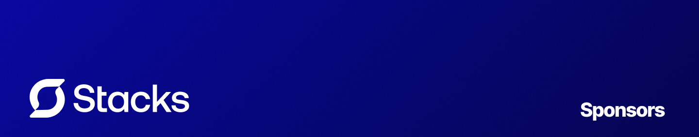

# Stacks Sponsors

We would like to extend our thanks to the following sponsors for funding Stacks development. If you are interested in becoming a sponsor, please reach out to us, or see [these](https://github.com/sponsors/chrisbbreuer) possibilties.

_This project is made possible by all the sponsors supporting our work:_

  

_This sponsorship list updates automatically. If you are a sponsor and your logo is missing, please reach out to us._

## Special Thanks

We are greatful for some of our founding sponsors, who have helped us get to where we are today.

- [JetBrains](https://www.jetbrains.com/)
- [The Solana Foundation](https://solana.com/)

## Community

For help, discussion about best practices, or any other conversation that would benefit from being searchable:

[Discussions on GitHub](https://github.com/stacksjs/ts-starter/discussions)

For casual chit-chat with others using this package:

[Join the Stacks Discord Server](https://discord.gg/stacksjs)

## Postcardware

Stacks OSS will always stay open-sourced, and we will always love to receive postcards from wherever Stacks is used! _And we also publish them on our website. Thank you, Spatie._

Our address: Stacks.js, 12665 Village Ln #2306, Playa Vista, CA 90094, United States 🌎

## 📄 License

The MIT License (MIT). Please see [LICENSE](LICENSE.md) for more information.

Made with 💙
